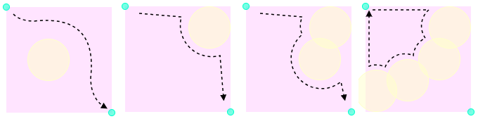
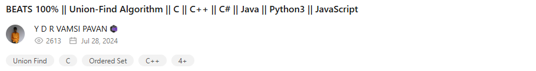
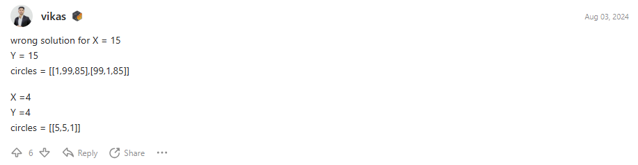
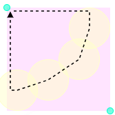
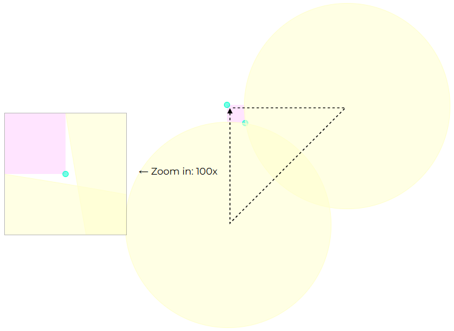

# LeetCode's Hardest Problem

According to [zerotrac's rating table](https://zerotrac.github.io/leetcode_problem_rating/), this is the number-one most difficult question on [LeetCode](https://leetcode.com/problems/check-if-the-rectangle-corner-is-reachable).


Very few people have successfully solved this problem.


## Check if the Rectangle Corner is Reachable

Frankly speaking, this question is straightforward. It is considered reachable if we can go from the top-left to the bottom-right. If there is a circle in our way, we just go around it.

If we loop back to the origin, we can conclude that it is unreachable.



## Geometry is Tricky

Although it looks easy, implementation is not an easy task. Therefore, most people, including the question's author, resort to a wrong approach.




Sadly, all solutions posted by the community wrongly use topology instead of geometry, and use circle centers instead of circumferences.



This is understandable because using points instead of lines is just one dimension less complex. This convenience blinds people.



In the above case of only two circles, they enter the rectangle and connect to each other, but they also exit the rectangle right before the corner, leaving the corner reachable. Unless we zoom in 100 times, our eyes can never see this tricky geometry.

## Code It

Go right, then go down, and go around the circles. ([moveStep.ts](./src/travels/moveStep.ts))

```ts
export function moveStep(currentStep: Step, question: Question) {
  switch (currentStep.type) {
    case StepType.RightLine:
      return moveRight(currentStep, question);

    case StepType.DownLine:
      return moveDown(currentStep, question);

    case StepType.ArcStep:
      return moveArc(currentStep, question);
  }

  return undefined;
}
```

## Deal with Geometry

"Go around the circles" is intuitive for humans but challenging to implement in code. Without visualizing it on a chart, we are left with just a series of intersection points. ([moveArc.ts](./src/travels/moveArc.ts))

```ts
function getArcNexts(currentStep: ArcStep, question: Question) {
  return question.circles
    .filter((circle) => circle !== currentStep.circle)
    .flatMap((circle) => getCircleIntersections(circle, currentStep.circle));
}
```

Equation of locus of circle is taught in school. But they didn't tell us one important thing - sweeping is directional. Therefore, finding the intersection points is not enough. We need to order by angles and take the counter-clockwise turn.

```ts
const currentAngle = Math.atan2(
  currentStep.y - currentStep.circle.y,
  currentStep.x - currentStep.circle.x
);

const outputNexts = inputNexts
  .map((next) => ({
    angle: next.angle - currentAngle,
    step: next.step,
  }))
  .sort((a, b) => a.angle - b.angle);

return outputNexts[outputNexts.length - 1].step;
```

## Interactive Page

If you want to learn more, I've created a interactive page for you.

<https://github.com/tommyinb/leetcode-hardest-problem>

Happy coding! 😊
