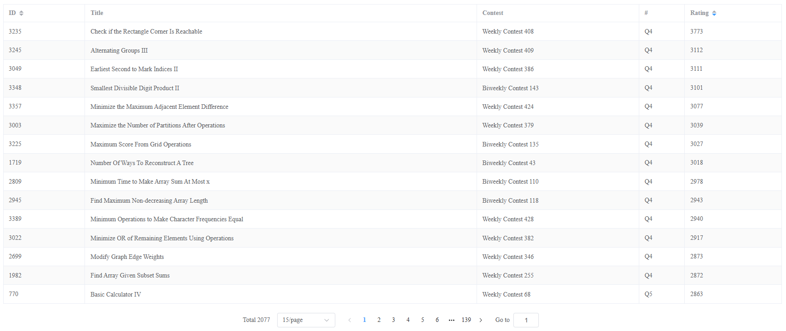
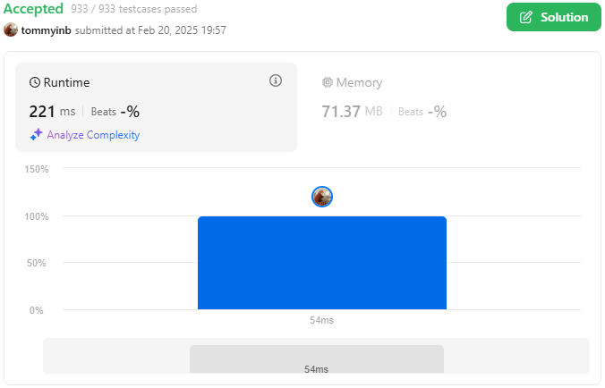
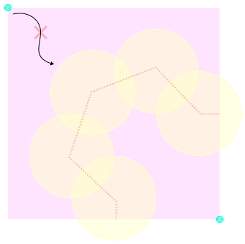

# LeetCode's Hardest Problem

This problem is rated **the most difficult** on [LeetCode](https://leetcode.com/problems/check-if-the-rectangle-corner-is-reachable) according to [zerotrac](https://zerotrac.github.io/leetcode_problem_rating/)'s rating table.



Fortunately, I managed to achieve a "beats 100%" score. ✌️



Learn more 👉 <https://tommyinb.github.io/leetcode-hardest-problem/>

## Check if the Rectangle Corner is Reachable

In fact, this question can be easily solved by BFS and simple geometry. We just need check if the circles can be connected together blocking all the path from origin to corner.



## Beats 100%

What makes my solution unique is the restructuring of the search algorithm. Instead of only progressing forward from the start, it also traces backward from the end. This significantly reduces the search space, resulting in much faster performance with minimal added complexity.

```ts
while ((currentCircle = currentCircles.shift())) {
  let started = false;

  for (const startPath of startPaths) {
    const pathCircle = startPath.circles[startPath.circles.length - 1];
    if (intersectingCircle(currentCircle, pathCircle, question.area)) {
      startPath.circles.push(currentCircle);

      started = true;
    }
  }

  for (const endPath of endPaths) {
    const pathCircle = endPath.circles[endPath.circles.length - 1];
    if (intersectingCircle(currentCircle, pathCircle, question.area)) {
      if (started) {
        return true;
      }

      endPath.circles.push(currentCircle);
    }
  }
}
```

## Interactive Page

In fact, the question is trickier than you could think of. If you're interested in learning more, I've created an interactive page that explains the solution in detail.

👉 <https://tommyinb.github.io/leetcode-hardest-problem/>

Happy coding! 😊
